# Manual de Usuario: Terapia Visual

## 1. Introducción

La aplicación **Terapia Visual** es una herramienta diseñada para superponer filtros de color configurables sobre la pantalla de su ordenador. Su objetivo principal es permitirle realizar ejercicios de terapia visual (como la división de campos visuales o la técnica de anti-supresión) de forma totalmente transparente.

Esto significa que usted podrá continuar utilizando sus aplicaciones cotidianas (navegadores de internet, documentos de texto, videos, etc.) o leer textos específicos sin que los filtros interrumpan el funcionamiento normal de su equipo.

## 2. Primeros Pasos

### 2.1 Proceso de Instalación

Para facilitarle las cosas, la aplicación cuenta con un instalador automático. Puede utilizar tanto el archivo terminado en `.msi` como el terminado en `.exe` (ambos funcionan exactamente igual). Por simplicidad, esta guía mostrará el proceso utilizando el instalador `.msi`.

1. Haga doble clic sobre el archivo instalador (ej. `terapia_visual_app_1.1.0_x64_en-US.msi`).

2. Aparecerá la ventana de bienvenida del programa. Haga clic en **Next (Siguiente)** para continuar.

    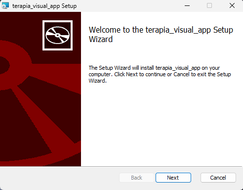

3. En la siguiente ventana, elija en qué carpeta desea instalar la aplicación (recomendado dejar la que viene por defecto) y haga clic en Next.

    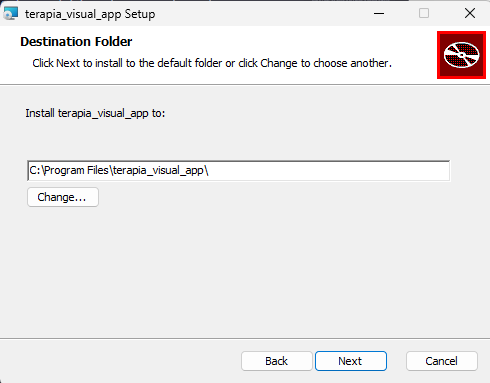

4. Finalmente, haga clic en **Install (Instalar)**.

    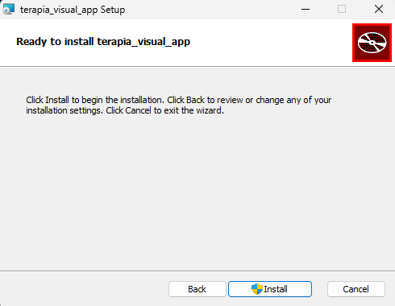

> 🛡️ **_Aviso de permisos_**: _Por seguridad, Windows oscurecerá la pantalla y le preguntará si permite que la aplicación realice cambios en el dispositivo. Debe hacer clic en **Sí** para que la instalación pueda completarse_.

    

5. Una vez terminada la barra de progreso, haga clic en **Finish (Finalizar)**.

    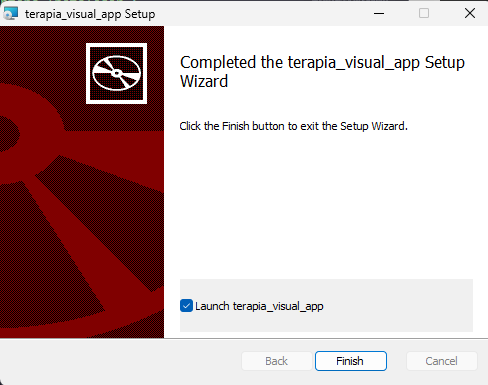

6. Para abrir la aplicación a partir de ahora, puede buscar "Terapia Visual" en el **menú de inicio** de Windows:

    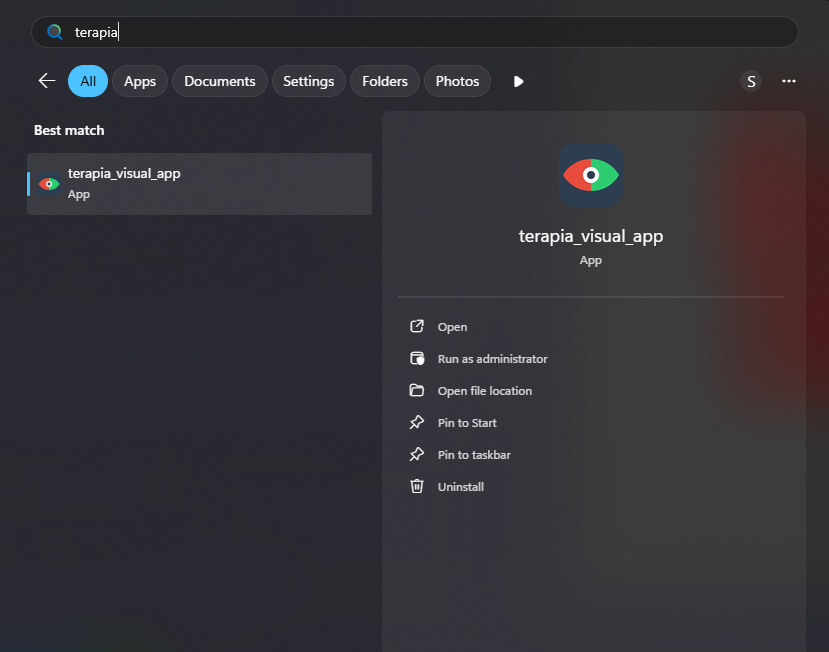

O simplemente hacer doble clic en el **acceso directo** que se ha creado en su escritorio:

    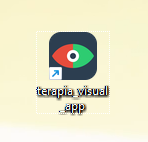

### 2.2 Solución a Bloqueos de Seguridad de Windows

Al ser un software privado de uso médico y no una aplicación comercial genérica de la tienda de Microsoft, es muy normal que el antivirus de su ordenador intente bloquearla la primera vez por precaución. No se asuste, es un procedimiento rutinario.

#### A. Si aparece una pantalla azul ("Windows protegió su PC"):

1. Haga clic en el texto pequeño que dice "Más información".

2. Aparecerá un botón nuevo en la parte inferior. Haga clic en **"Ejecutar de todas formas"**. _(Esto solo se lo pedirá la primera vez que abra el programa)._

#### B. Si el "Control Inteligente de Aplicaciones" bloquea el programa:

Deberá desactivar esta función de Windows temporalmente:

1. Haga clic en el botón de Inicio de Windows y escriba Control Inteligente de Aplicaciones en el buscador. Abra esa configuración.

2. En la ventana que se abre, marque la opción **Desactivado**.

> ⚠️ _**Nota**: Se recomienda volver a activar esta opción una vez que haya terminado su sesión de terapia si desea mantener la máxima seguridad de Windows._

### 2.3 Menú Principal

Al abrir la aplicación, verá el menú principal. Desde aquí podrá elegir qué modalidad de terapia desea utilizar.

    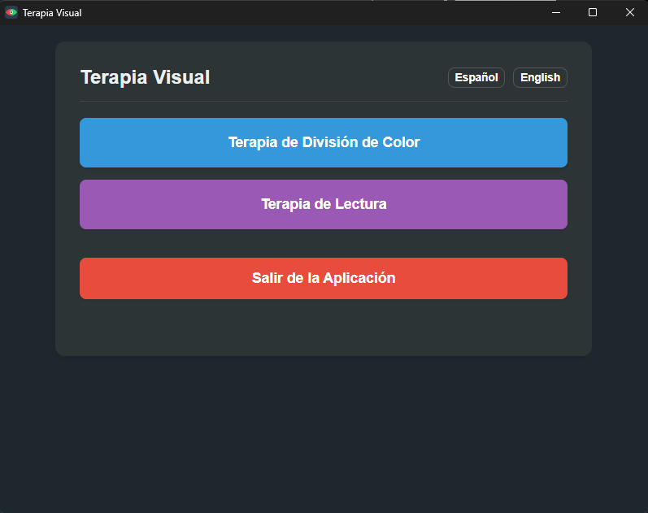

- **Idioma**: En la esquina superior derecha puede alternar entre Español e Inglés. La aplicación cambiará el idioma instantáneamente y recordará su preferencia para futuras sesiones.

- **Terapia de División de Color**: Inicia la modalidad de superposición (Overlay) que cubre toda la pantalla del PC.

- **Terapia de Lectura**: Inicia la modalidad inmersiva de lectura en una ventana separada.

- **Información de Atajos (i)**: En la esquina inferior derecha encontrará un icono de información que, al pasar el ratón por encima, le recordará los atajos de teclado del sistema.

## 3. Terapia de División de Color (Pantalla Completa)

Esta terapia superpone filtros de colores sobre todo su entorno de Windows, permitiéndole hacer clics a través de ellos para seguir usando su PC con normalidad.

Dentro de esta vista, encontrará los controles para Iniciar, Detener o Restablecer la terapia a sus valores seguros por defecto. Todos los cambios realizados se guardan automáticamente.

    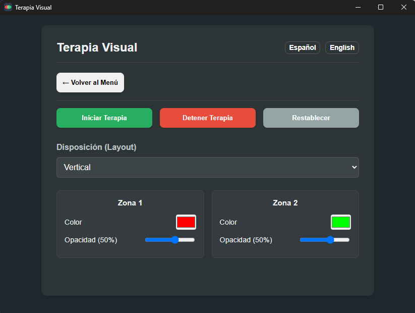

### 3.1 Disposición (Layout)

El menú desplegable le permite elegir cómo se divide la pantalla. Las opciones actuales son:

- **Vertical**: Divide la pantalla en dos mitades (Izquierda y Derecha).
- **Horizontal**: Divide la pantalla en dos mitades (Arriba y Abajo).
- **Ajedrez**: Divide la pantalla en cuatro cuadrantes alternados.
- **Vertical (4 Columnas)**: Divide la pantalla en cuatro franjas verticales.
 

    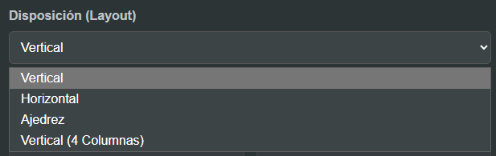

### 3.2 Configuración de Zonas (Color y Opacidad)

En la parte inferior verá unas "tarjetas" que representan cada zona de color activa. Siéntase libre de ajustarlas a su gusto; la aplicación guardará sus cambios automáticamente.

- **Color**: Haga clic en el rectángulo de color sólido para abrir el selector y elegir el tono exacto que necesite.
- **Opacidad (Transparencia)**: Mueva el punto azul hacia la derecha para hacer el color más sólido, o hacia la izquierda para hacerlo más transparente.
- **Límite de Seguridad**: Por seguridad del usuario, la opacidad máxima está limitada al 80%. Esto garantiza que la pantalla nunca quede bloqueada por completo y los iconos subyacentes sigan siendo siempre visibles.  

    

**Reglas de Sincronización Automática**

Para facilitar su uso y mantener la coherencia terapéutica, ciertos layouts sincronizan los colores de forma inteligente:

- En **Ajedrez**, los colores se copian en diagonal (si cambia la esquina superior izquierda, la esquina inferior derecha cambiará sola).

- En **Vertical (4 Columnas)**, los colores se alternan (La columna 1 copia a la 3, y la columna 2 a la 4).

    

## 4. Terapia de Lectura

A diferencia de la pantalla completa, la **Terapia de Lectura** abre una ventana dedicada similar a un libro electrónico. Su propósito es aislar el texto y aplicarle los filtros de color y ajustes visuales **exclusivamente al documento**, sin teñir el resto de su ordenador.

    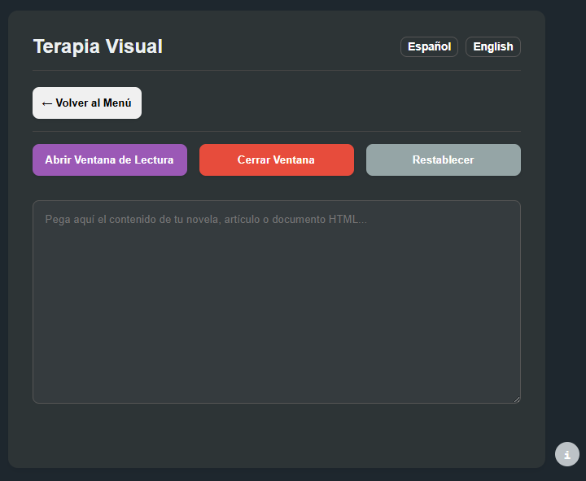

En este menú encontrará 3 botones principales:

- **Abrir Ventana de Lectura**: Lanza la ventana inmersiva. (Debe haber pegado un texto primero).
- **Cerrar Ventana**: Cierra la ventana de lectura en caso de estar abierta.
- **Restablecer**: Reinicia la configuración de la terapia a sus valores por defecto.

### 4.1 Uso de la Terapia de Lectura

Para comenzar a leer, siga estos pasos:

1. Entre a la sección "Terapia de Lectura" desde el menú principal.

2. Busque el texto, artículo de noticias o fragmento de libro que desee leer. Selecciónelo, haga clic derecho y elija "Copiar" (o presione `Ctrl + C`).

3. Vuelva a la aplicación Terapia Visual y **pegue el texto dentro del cuadro grande gris** (`Ctrl + V`). La aplicación se encargará de limpiar fotos o estilos raros para dejar solo la lectura limpia.

4. Finalmente, haga clic en el botón morado **"Abrir Ventana de Lectura"**.

    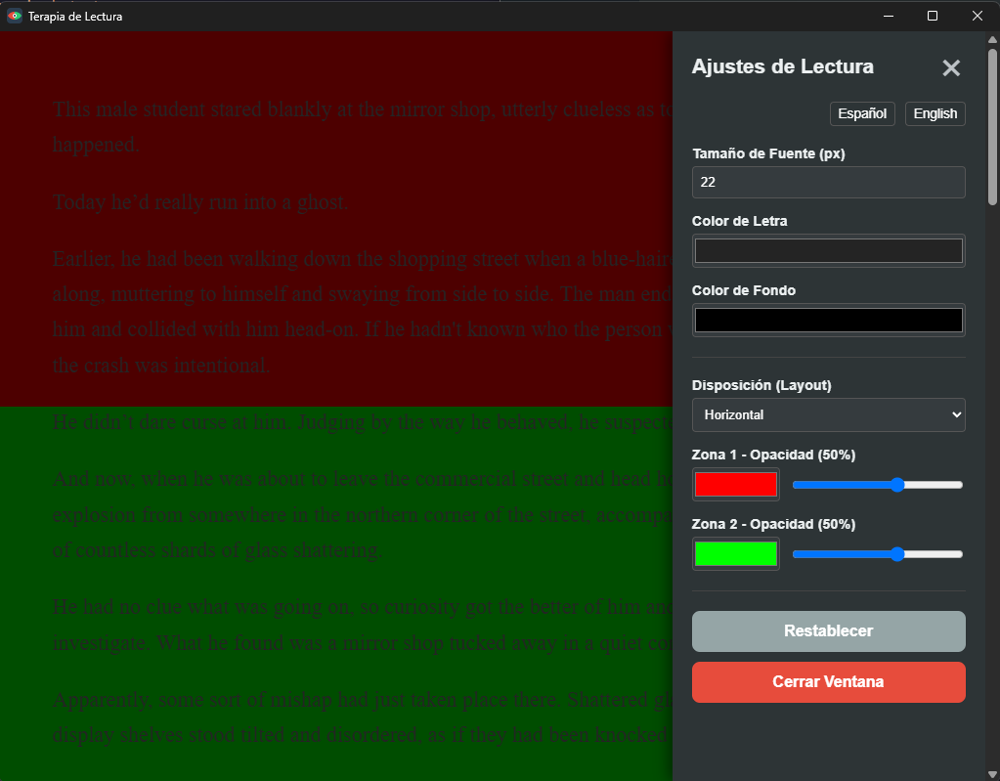

### 4.2 Panel Flotante de Ajustes

Una vez que la ventana de lectura esté abierta en su pantalla, notará un icono redondo con un engranaje (⚙️) flotando en la esquina superior derecha. Haga clic sobre él para desplegar el panel de ajustes laterales.

Este panel le permite modificar su experiencia en tiempo real mientras lee, sin tener que volver al menú principal:

    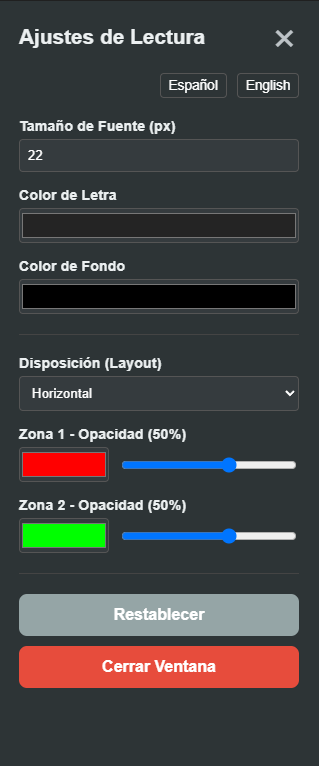

- **Ajustes de Lectura**: Modifique a su gusto el tamaño de la letra para no forzar la vista, el color del texto y el color del fondo de la página.

  > (**_Nota clínica_**: Para la técnica de anti-supresión con gafas anaglifas, se recomienda dejar los valores por defecto: letra gris oscura sobre fondo negro puro).

- **Zonas y Filtros**: Cambie la disposición, los colores y las opacidades de la misma forma que en la terapia a pantalla completa. La lectura se adaptará sin importar el tamaño de la ventana.

- **Restablecer y Cerrar**: Al final del panel encontrará un botón para "Restablecer" los valores a la normalidad y un botón rojo para cerrar la ventana por completo.

## 5. Atajos de Teclado Globales

Para una experiencia fluida, la aplicación cuenta con atajos de teclado que funcionan incluso si la aplicación está minimizada o usted se encuentra en otra ventana:

- `Ctrl + Shift + T`: Enciende o apaga instantáneamente la **Terapia de División de Color** (Pantalla completa).

- `Ctrl + Shift + Alt + L`: Abre instantáneamente la vista de **Terapia de Lectura**.

## 6. Uso en Segundo Plano (Bandeja del Sistema)

Para que el panel de control no estorbe, la aplicación está diseñada para funcionar de forma oculta en la bandeja del sistema (junto al reloj de Windows).

- **Minimizar**: Si hace clic en la "X" (Cerrar) en la ventana principal, la aplicación no se cerrará; simplemente se ocultará para dejarle la pantalla libre.

- **Icono Dinámico**: El icono de la aplicación (el Ojo) cambiará automáticamente de gris a colores cuando alguna terapia esté activa en la pantalla.

- **Restaurar y Navegar**: Haga clic derecho sobre el icono en la bandeja para abrir un menú rápido que le permitirá restaurar el menu principal de la app o saltar directamente a la configuración de cualquiera de las dos terapias, también puede hacer **doble clic** para restaurar la ventana

- **Cerrar por completo**: Seleccione la opción "Salir" en este menú, o presione el botón rojo "Salir de la Aplicación" en el menú principal para cerrar el programa.

    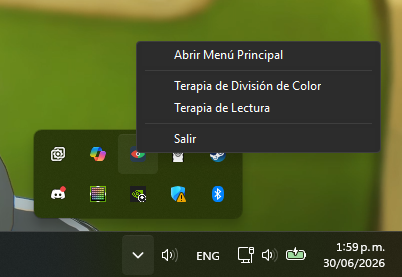

