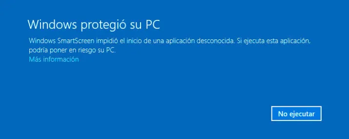
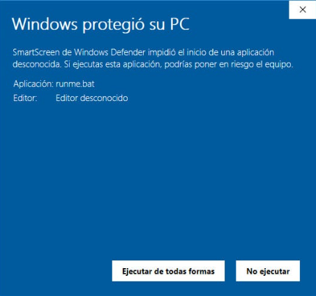
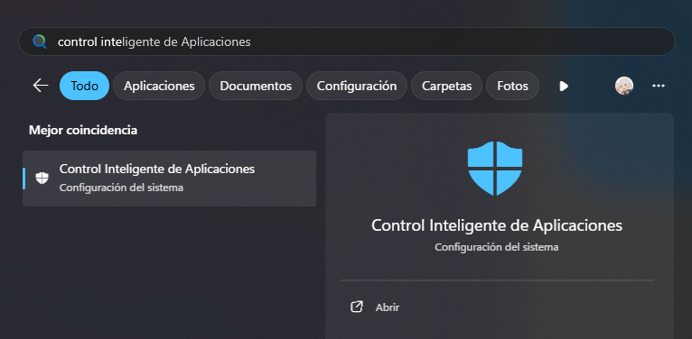
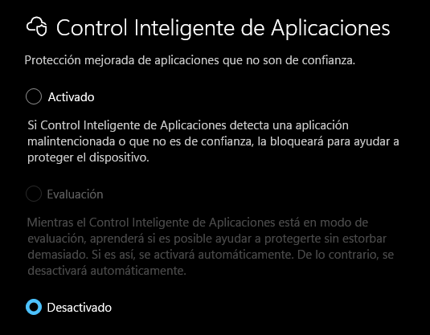
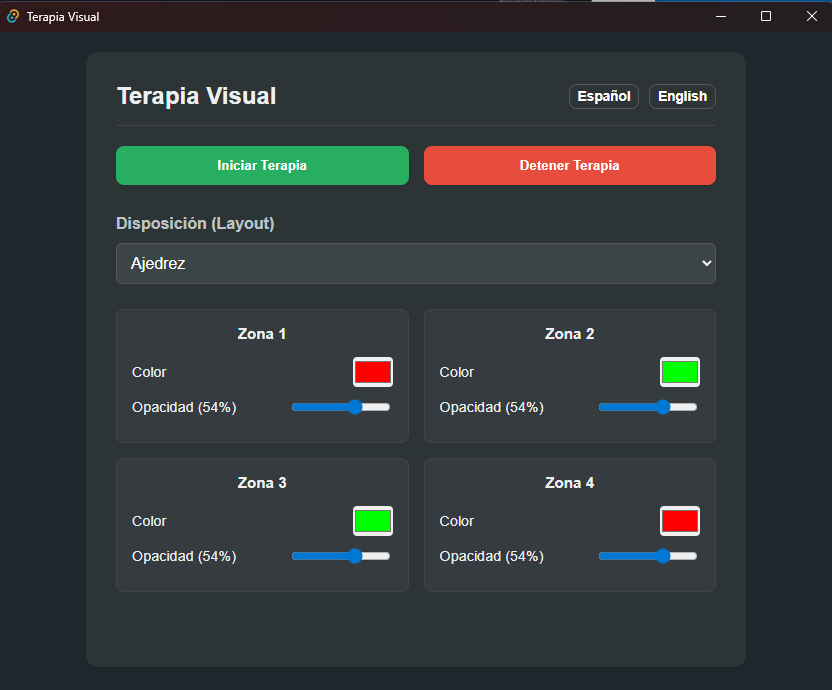
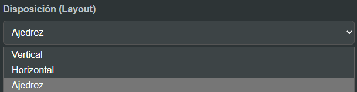
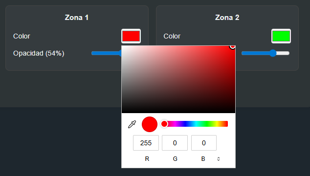
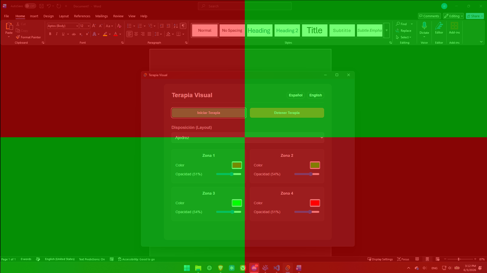
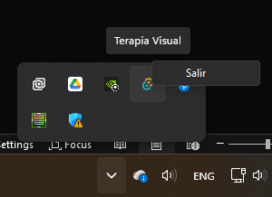

# Manual de Usuario: Terapia Visual

## 1. Introducción

La aplicación **Terapia Visual** es una herramienta de software diseñada para superponer filtros de color configurables sobre la pantalla del ordenador. Su objetivo es permitir a los usuarios realizar ejercicios de terapia visual (como la división de campos visuales) de forma transparente mientras continúan utilizando sus aplicaciones cotidianas (navegador, documentos, videos, etc.) sin interferencias.

## 2. Primeros Pasos

### 2.1 Ejecución de la Aplicación

La aplicación es **100% portable**. No requiere ningún proceso de instalación. Para iniciarla, simplemente haga doble clic en el archivo `terapia_visual_app.exe`.

> **Nota de Seguridad de Windows**: Al ser un software privado, es posible que la primera vez que lo ejecute aparezca una pantalla azul de "Windows protegió su PC" (SmartScreen).

Para continuar:

- Haga clic en el texto "Más información".

    

- Haga clic en el botón "Ejecutar de todas formas".  
Esto solo ocurrirá la primera vez.

    

**EN CASO DE NO FUNCIONAR**

Desactive temporalmente y con cuidado el **Control Inteligente de Aplicaciones**:

- Dirijase al menú principal de Windows y escriba `Control Inteligente de Aplicaciones`.

    

- Y seleccione el **Desactivado**.

    

> **RECUERDE ACTIVARLO LUEGO DE USAR LA APLICACIÓN**

### 2.2 Interfaz Principal

Al abrir la aplicación, verá el panel de control principal. Desde aquí podrá gestionar todas las configuraciones de la terapia.

    

- **Idioma**: En la esquina superior derecha puede alternar entre Español e - **Inglés**. La aplicación recordará su preferencia automáticamente.
- **Controles de Terapia**: Los botones centrales permiten Iniciar y Detener la superposición de colores en cualquier momento.

## 3. Configuración de la Terapia

La superposición se divide en zonas o "campos". Usted puede personalizar cómo se distribuyen estas zonas y qué propiedades tiene cada una. Todos los cambios realizados se guardan automáticamente para su próxima sesión.

### 3.1 Disposición (Layout)

El menú desplegable le permite elegir cómo se divide la pantalla. Las opciones actuales son:

- **Vertical**: Divide la pantalla en dos mitades (Izquierda y Derecha).
- **Horizontal**: Divide la pantalla en dos mitades (Arriba y Abajo).
- **Ajedrez**: Divide la pantalla en cuatro cuadrantes alternados.  

    

### 3.2 Configuración de Zonas (Color y Opacidad)

Debajo del selector de Layout, verá una "tarjeta" por cada zona activa en su pantalla.

- **Color**: Haga clic en el recuadro de color para abrir el selector y elegir el tono deseado.
- **Opacidad**: Utilice la barra deslizante para ajustar la intensidad del color.
- **Límite de Seguridad**: Por seguridad del usuario, la opacidad máxima está limitada al 80%. Esto garantiza que la pantalla nunca quede bloqueada por completo y los iconos subyacentes sigan siendo siempre visibles.  

    

**Regla Especial del Layout "Ajedrez"**

Cuando seleccione la disposición en **Ajedrez**, notará que la pantalla se divide en 4 zonas. Para facilitar su uso y mantener la coherencia terapéutica, la aplicación **sincroniza los colores en diagonal automáticamente**.

Si usted cambia el color o la opacidad de la Zona 1 (Arriba-Izquierda), la Zona 4 (Abajo-Derecha) se actualizará sola para coincidir. Lo mismo ocurre con las zonas 2 y 3.

    

## 4. Uso en Segundo Plano (Bandeja del Sistema)

Para que el panel de control no estorbe mientras se realiza la terapia, la aplicación está diseñada para funcionar de forma oculta en la bandeja del sistema (el área junto al reloj de Windows).

- **Minimizar**: Si hace clic en la "X" (Cerrar) en la ventana principal, la aplicación no se cerrará; simplemente se ocultará para dejarle la pantalla libre.
- **Restaurar**: Para volver a ver el panel de control, busque el icono de la aplicación junto al reloj de Windows y haga doble clic sobre él.
- **Cerrar por completo**: Para apagar y salir definitivamente de la aplicación, haga clic derecho sobre el icono junto al reloj y seleccione "Salir".

    

